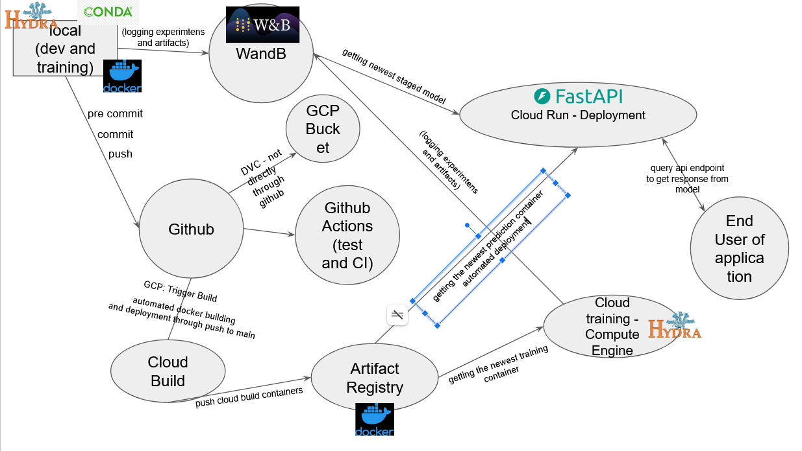
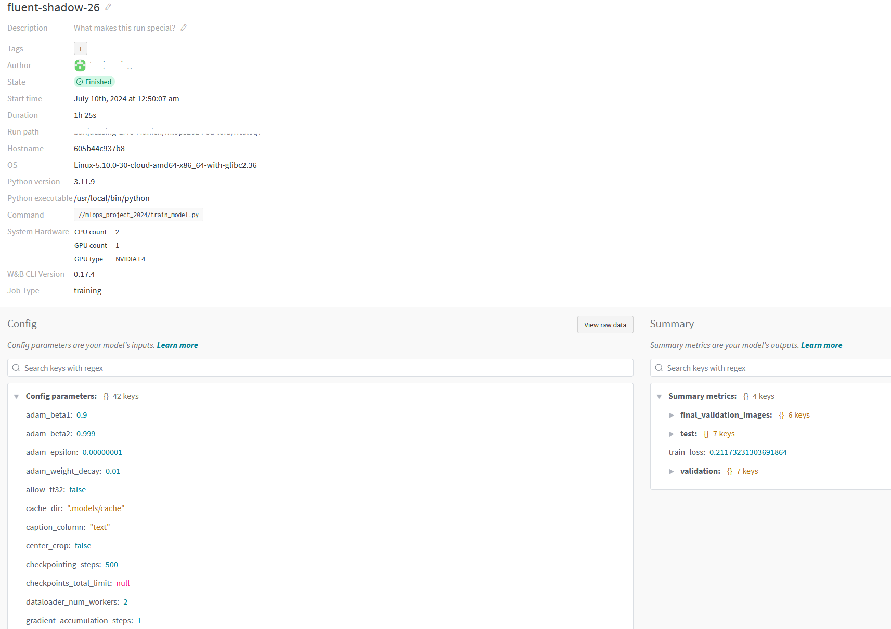

# Stable Diffusion LoRA MLOps Pipeline

End-to-end MLOps project for fine-tuning and serving a **Stable Diffusion** model with **LoRA (Low-Rank Adaptation)** to generate professional portrait-style images from user-provided photos.

The project covers the full machine-learning lifecycle, including data preparation, parameter-efficient fine-tuning, experiment tracking, testing, containerization, cloud training, API-based inference, CI/CD, deployment, and monitoring.

---


## Project Overview

The goal of the project was to build an end-to-end system that transforms user-provided portrait images into professional profile or CV-style images using a pre-trained Stable Diffusion model.

Rather than training a diffusion model from scratch, we used the **Hugging Face Diffusers** ecosystem and fine-tuned a pre-trained Stable Diffusion model using **LoRA**, enabling parameter-efficient adaptation with substantially fewer trainable parameters.

Beyond model development, the project focused heavily on the engineering required to make the system reproducible and deployable. The final workflow included experiment tracking, configuration management, Docker-based environments, automated testing, cloud training, model artifact management, API serving, deployment, and production monitoring.

---

## Project Highlights

- Fine-tuned a pre-trained **Stable Diffusion** model using **LoRA**
- Built image-to-image inference workflows using **Hugging Face Diffusers**
- Managed experiment configurations with **Hydra**
- Tracked experiments, configurations, generated samples, and model artifacts with **Weights & Biases**
- Containerized training and inference workflows with **Docker**
- Served model inference through a **FastAPI** application
- Implemented automated testing and code-quality checks
- Set up **GitHub Actions** for continuous integration
- Used **DVC** together with **Google Cloud Storage** for data versioning
- Trained the model on **Google Compute Engine** with GPU resources
- Built Docker images with **Google Cloud Build**
- Stored container images in **Google Artifact Registry**
- Deployed the inference service to **Google Cloud Run**
- Monitored service uptime, latency, requests, errors, and resource usage with **Google Cloud Monitoring**

---

## System Architecture

The project combines local development, experiment tracking, CI/CD, cloud-based training, and deployment into a reproducible MLOps workflow.

<p align="center">
  
</p>

The workflow can be summarized as follows:

1. Model development and experimentation are performed locally.
2. **Hydra** manages model and experiment configurations.
3. **Weights & Biases** tracks training runs, configurations, generated images, and model artifacts.
4. Code changes pushed to GitHub trigger automated checks using **GitHub Actions**.
5. **Google Cloud Build** builds Docker images for training and inference.
6. Container images are stored in **Google Artifact Registry**.
7. Training containers are executed on **Google Compute Engine**.
8. Training data is stored in **Google Cloud Storage** and versioned using **DVC**.
9. The inference container exposes the model through a **FastAPI** endpoint.
10. The application is deployed using **Google Cloud Run**.
11. **Google Cloud Monitoring** is used to track operational performance.

---
## Team

This project was developed collaboratively by:

- **Luyang Chu**
- **Jan Büssing**
- **Setareh Fadavi**
- **Thi Thuy Pham**

---

## My Contributions to the Project

This was a collaborative group project. My main contributions (**Setareh Toodeh Fadavi**) included:

- collecting data used for model training
- contributing to data preprocessing
- developing the inference pipeline using pre-trained Diffusers models
- building the inference Docker container used by the FastAPI prediction service
- aligning the inference Docker configuration with the training environment
- developing the local FastAPI application for model inference
- contributing to the Google Cloud Build deployment configuration
- implementing tests for data processing and model training
- calculating test coverage
- contributing to the project report and technical documentation

---

## Technology Stack

### Machine Learning

- Python
- PyTorch
- Hugging Face Diffusers
- Transformers
- PEFT / LoRA
- Torchvision
- Pillow
- Hugging Face Datasets

### MLOps & Experiment Management

- Weights & Biases
- Hydra
- DVC
- Git
- GitHub Actions
- Docker

### Cloud Infrastructure

- Google Compute Engine
- Google Cloud Storage
- Google Cloud Build
- Google Artifact Registry
- Google Cloud Run
- Google Cloud Monitoring
- Google Secret Manager

### API & Software Engineering

- FastAPI
- Pytest
- Ruff
- Mypy
- Flake8
- Autopep8

---

## Model Development

The project uses a pre-trained model from the **Stable Diffusion** family and adapts it to professional portrait generation using **LoRA**.

LoRA provides a parameter-efficient approach to fine-tuning large generative models by updating a comparatively small number of additional parameters rather than retraining the full model.

The model was trained on professional portrait-style images with associated captions. The resulting LoRA weights are stored in:

```text
models/pytorch_lora_weights.safetensors
```

The main training implementation is located in:

```text
mlops_project_2024/train_model.py
```

---

## Inference Pipeline

The inference pipeline uses the fine-tuned LoRA weights together with a pre-trained Stable Diffusion model to generate professional portrait-style images.

The prediction implementation is located in:

```text
mlops_project_2024/predict_model.py
```

During development, inference experiments were also performed in:

```text
notebooks/inference_dev.ipynb
```

Generated output files are stored in:

```text
outputs/
```

---

## Experiment Tracking

We used **Weights & Biases (W&B)** to track:

- training loss
- hyperparameters
- complete experiment configurations
- intermediate generated images
- final validation images
- trained LoRA model artifacts

Tracking the complete experiment configuration made it possible to compare runs and reproduce previous experiments.

Because the task involved generative image modeling, visual outputs were an important part of model evaluation in addition to the training loss.

<p align="center">
  
</p>

Additional W&B screenshots are available in the project report.

---

## Configuration Management

Experiments are configured using **Hydra**.

Configuration files are located in:

```text
mlops_project_2024/config/
```

including:

```text
default_config.yaml
Default_config_all.yaml
example_config.yaml
```

The configuration files contain parameters such as training settings, data paths, and experiment-specific options.

Keeping experiment parameters separate from the training code improved reproducibility and made it easier to compare different model configurations.

---

## Docker

Separate Docker environments were created for model training and inference:

```text
dockerfiles/
├── predict_model.dockerfile
└── train_model.dockerfile
```

Docker was used to provide consistent environments across local development machines and Google Cloud infrastructure.

An example build command for the prediction container is:

```bash
docker build -f dockerfiles/predict_model.dockerfile -t predict:latest .
```

The containerized setup helped avoid dependency and operating-system inconsistencies across development and deployment environments.

---

## Cloud Training

Model training was performed on **Google Compute Engine** using a GPU-enabled virtual machine.

The project used:

- Machine type: `g2-standard-4`
- GPU: `1 × NVIDIA L4`
- Boot disk: `100 GB`

Training data was stored in a **Google Cloud Storage bucket** and integrated with **DVC** for data versioning.

Docker images built through the cloud pipeline were used to provide a reproducible training environment.

---

## API & Deployment

The inference model was wrapped in a **FastAPI** application.

The API accepts input data and invokes the Stable Diffusion inference pipeline to generate the output image.

The application was first tested locally using Docker and was subsequently deployed to **Google Cloud Run**.

The deployment workflow used:

```text
GitHub
   ↓
GitHub Actions
   ↓
Google Cloud Build
   ↓
Artifact Registry
   ↓
Cloud Run
```

This provided a containerized and scalable inference service while keeping the deployment environment consistent with local development.

---

## CI/CD

Continuous integration was implemented using **GitHub Actions**.

The CI workflow included checks for:

- unit tests
- Python code quality
- formatting
- linting
- type checking

Pull requests were used during development to review changes before merging them into the main branch.

Cloud Build was additionally used to automate Docker image creation for deployment to Google Cloud.

---

## Testing

Tests cover data processing, model-related functionality, and API behavior.

```text
test/
├── test_api.py
├── test_data.py
└── test_model.py
```

The project implemented seven tests covering different parts of the data-processing and model workflow.

For the tested data-processing component, the measured code coverage reached **87%**.

High code coverage alone does not guarantee correctness, so testing was combined with code review, automated quality checks, and manual validation of the generative model outputs.

---

## Monitoring

The deployed Cloud Run service was monitored using **Google Cloud Monitoring**.

Operational metrics included:

- service uptime
- latency
- request counts
- error rates
- memory usage
- application errors

Monitoring was particularly relevant for inference latency because the deployed service could run inference with more limited compute resources than the GPU-based training environment.


---

## Project Structure

```text
.
├── LICENSE
├── Makefile
├── README.md
│
├── data/
│   ├── processed/
│   └── raw/
│
├── dockerfiles/
│   ├── predict_model.dockerfile
│   └── train_model.dockerfile
│
├── docs/
│
├── environment.yml
│
├── mlops_project_2024/
│   ├── config/
│   │   ├── default_config.yaml
│   │   ├── Default_config_all.yaml
│   │   └── example_config.yaml
│   │
│   ├── data/
│   │   └── make_dataset.py
│   │
│   ├── models/
│   │   └── model.py
│   │
│   ├── predict_model.py
│   ├── train_model.py
│   │
│   └── visualization/
│       └── visualize.py
│
├── models/
│   └── pytorch_lora_weights.safetensors
│
├── notebooks/
│   └── inference_dev.ipynb
│
├── outputs/
│
├── reports/
│   ├── README.md
│   ├── report.html
│   └── figures/
│
├── requirements.txt
├── requirements_dev.txt
├── requirements_test.txt
│
├── test/
│   ├── test_api.py
│   ├── test_data.py
│   └── test_model.py
│
└── vertex_ai_train.yaml
```

---

## Installation

Clone the repository and move into the project directory:

```bash
git clone <repository-url>
cd MLOps_SD
```

Create the project environment using Conda:

```bash
conda env create -f environment.yml
conda activate <environment-name>
```

Alternatively, install the Python dependencies using:

```bash
pip install -r requirements.txt
```

Development and testing dependencies are listed separately in:

```text
requirements_dev.txt
requirements_test.txt
```

---

## Reproducibility

Several components were used to support reproducible experimentation:

- **Hydra** for experiment configuration
- **Weights & Biases** for tracking hyperparameters, training runs, visual outputs, and model artifacts
- **Docker** for reproducible execution environments
- **DVC** for dataset versioning
- **Git** for source-code version control
- dependency files for environment reconstruction

Together, these components allow experiments and deployment environments to be reconstructed more consistently across local and cloud infrastructure.

---

## Detailed Project Report

A more detailed description of the experiments, infrastructure, cloud deployment, testing strategy, monitoring setup, and project architecture is available in the full project report:

**[View the full project report](reports/README.md)**

---

## Key Takeaways

This project was not limited to fine-tuning a generative model. It provided hands-on experience across the complete ML engineering lifecycle:

**data → training → experiment tracking → testing → containerization → CI/CD → cloud training → API serving → deployment → monitoring**

The project demonstrated how modern ML tooling can be combined to move a generative model from experimentation toward a reproducible and deployable system.
